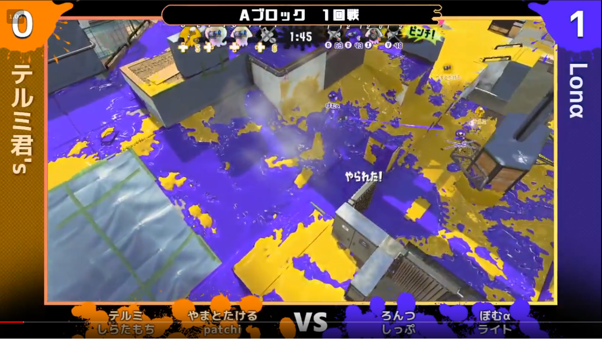

64GB Live Streaming Layouts for StreamControl
====

We release layout files for StreamControl used by "64GB", an organization that performs live streaming of video games.

ゲーム配信チーム「64GB」で使用しているレイアウトファイルを公開しています。

## Usage
Please refer to the following website for how to use this software.

このソフトウェアの使い方は、下記のウェブサイトを参照してください。

### Developer's website
http://farpnut.net/streamcontrol/

### Important point
Currently, this layout has a limit on the number of characters that can be displayed in the space for team names and the space for player names.
Only 10 characters can be displayed on one line for team names and 8 characters for player names. If the number of characters is exceeded, the entered characters will be displayed on a new line.
If you want to display long names, modify the layout file accordingly and use it.

現状では、このレイアウトはチーム名のスペースおよび選手名のスペースに表示できる文字数に上限があります。
1行に表示できるのはチーム名の場合10文字、選手名の場合は8文字です。その文字数を超えた場合、入力した文字は改行して表示されます。
長い名前を表示したい場合、レイアウトファイルを適宜修正して使って下さい。

## Licence
https://github.com/anaakikutushita/64GB_Streaming_Layout/blob/master/LICENSE.txt
